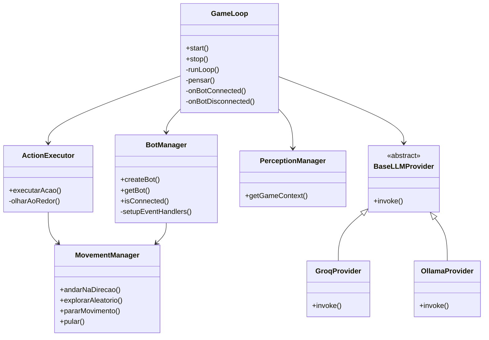

Este documento descreve a arquitetura do projeto usando o modelo C4 (Context, Container, Component, Code) com diagramas Mermaid. O projeto é um bot autônomo para Minecraft que utiliza IA para tomar decisões, baseado em percepções do ambiente.

## 1. Context Diagram (C1)

Visão geral do sistema, mostrando os atores externos e o sistema principal.

```mermaid

graph TD
    A[Jogador de Minecraft] --> B[Servidor Minecraft]
    B --> C[Bot de Minecraft com IA]
    C --> D[Provedor de IA (Groq/Ollama)]
    E[Administrador] --> C

```

- **Jogador de Minecraft**: Interage com o bot no servidor.
- **Servidor Minecraft**: Ambiente onde o bot opera.
- **Bot de Minecraft com IA**: Sistema principal que controla o bot.
- **Provedor de IA**: Fornece inteligência para decisões (Groq ou Ollama).
- **Administrador**: Configura e monitora o sistema.

## 2. Container Diagram (C2)

Mostra os containers (aplicações e serviços) e suas interações.

```mermaid
graph TD
    subgraph "Aplicação Node.js (Bot)"
        F[GameLoop] --> G[BotManager]
        F --> H[ActionExecutor]
        F --> I[PerceptionManager]
        F --> J[LLMProvider]
        G --> K[Mineflayer]
        H --> L[MovementManager]
    end
    M[Servidor Minecraft] --> K
    N[Provedor de IA] --> J
    O[Configurações (.env)] --> F
```

- **Aplicação Node.js**: Executa o bot em TypeScript.
  - GameLoop: Coordena o loop de percepção → pensamento → ação.
  - BotManager: Gerencia conexão com Minecraft via Mineflayer.
  - ActionExecutor: Executa ações decididas.
  - PerceptionManager: Coleta dados do ambiente.
  - LLMProvider: Interface com IA (Groq ou Ollama).
  - MovementManager: Controla movimento do bot.
- **Servidor Minecraft**: Hospeda o mundo e jogadores.
- **Provedor de IA**: API externa para geração de decisões.
- **Configurações**: Arquivo .env para parâmetros.

## 3. Component Diagram (C3)

Detalha os componentes dentro do container principal (Aplicação Node.js).

```mermaid
graph TD
    A[GameLoop] --> B[runLoop]
    A --> C[pensar]
    A --> D[onBotConnected]
    B --> E[PerceptionManager.getGameContext]
    C --> F[LLMProvider.invoke]
    F --> G[botActionSchema.parse]
    D --> H[ActionExecutor.constructor]
    D --> I[PerceptionManager.constructor]
    H --> J[MovementManager.constructor]
    K[BotManager] --> L[createBot]
    L --> M[mineflayer.createBot]
    M --> N[setupEventHandlers]
    N --> O[bot.on('spawn')]
    N --> P[bot.on('chat')]
    N --> Q[bot.on('death')]
    N --> R[bot.on('end')]
    N --> S[bot.on('physicsTick')]
```

- **GameLoop**: Loop principal com métodos para executar o ciclo.
- **BotManager**: Gerencia eventos e reconexão.
- **ActionExecutor**: Executa ações como andar, falar, etc.
- **PerceptionManager**: Coleta contexto (vida, posição, etc.).
- **MovementManager**: Controla movimento e navegação.
- **LLMProvider**: Abstração para provedores de IA.

## 4. Code Diagram (C4)

Diagrama de classes mostrando as principais classes e suas relações.



- Relações baseadas em dependências: GameLoop usa BotManager, ActionExecutor, etc.
- Provedores de IA herdam de BaseLLMProvider.
