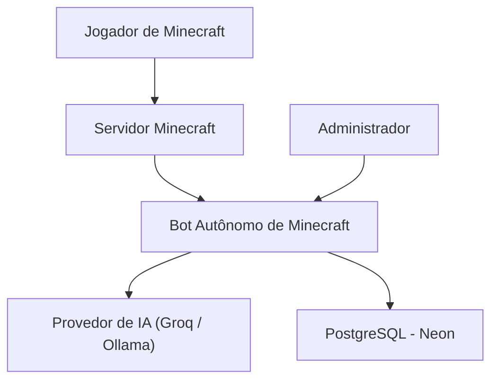
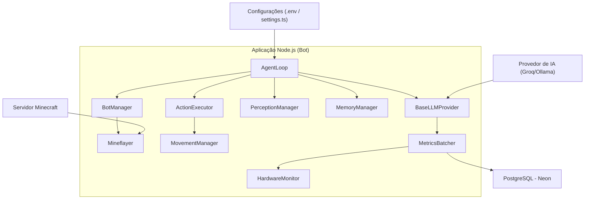
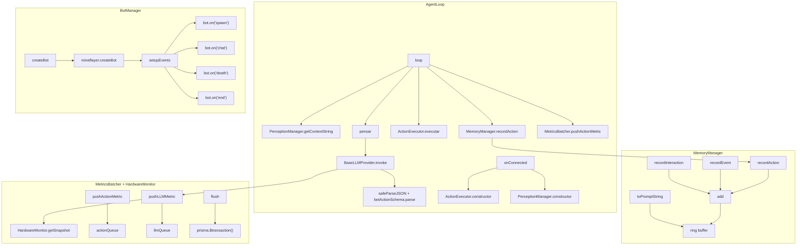
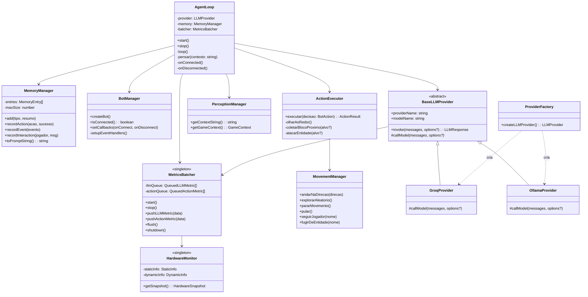

Este documento descreve a arquitetura do projeto usando o [modelo C4](https://c4model.com/diagrams) (Context, Container, Component, Code) com diagramas [Mermaid](https://www.mermaidchart.com/app/dashboard). O projeto é um bot autônomo para Minecraft que utiliza IA para tomar decisões, baseado em percepções do ambiente.

> Use a [extensão Markdown Preview Mermaid](https://marketplace.visualstudio.com/items?itemName=bierner.markdown-mermaid) para visualizar os diagramas diretamente no VS Code.

## 1. Context Diagram (C1)

Visão geral do sistema, mostrando os atores externos e o sistema principal.

- **Jogador de Minecraft**: Interage com o bot no servidor (chat, proximidade).
- **Servidor Minecraft**: Ambiente onde o bot opera via protocolo Mineflayer.
- **Bot Autônomo de Minecraft**: Sistema principal — percebe, raciocina, age e registra métricas.
- **Provedor de IA**: API externa (Groq) ou local (Ollama) para geração de decisões.
- **PostgreSQL (Neon)**: Banco cloud que armazena métricas de LLM e ações do bot.
- **Administrador**: Configura variáveis de ambiente e monitora o sistema.

## 2. Container Diagram (C2)

Mostra os containers (aplicações e serviços) e suas interações.

- **AgentLoop**: Orquestra o ciclo Percepção → Memória → Raciocínio → Ação.
- **BotManager**: Gerencia conexão e eventos do bot via Mineflayer.
- **ActionExecutor**: Executa as ações decididas pela IA (incluindo SEGUIR, FUGIR, COLETAR, ATACAR).
- **PerceptionManager**: Coleta `GameContext` completo (inventário, entidades, blocos, bioma, clima).
- **MemoryManager**: Ring buffer de curto prazo — injeta histórico no prompt a cada ciclo.
- **BaseLLMProvider**: Abstração dos providers com timing e métricas automáticas.
- **MetricsBatcher**: Acumula métricas em memória e grava em lote no PostgreSQL.
- **HardwareMonitor**: Snapshot de hardware com cache (info estática 1x, dinâmica throttled 5s).
- **MovementManager**: Controla movimento, follow, flee e exploração.

## 3. Component Diagram (C3)

Detalha os componentes dentro do container principal (Aplicação Node.js).

- **AgentLoop**: Ciclo principal; o campo `raciocinio` do JSON é logado antes de executar a ação.
- **MemoryManager**: Ring buffer em memória (zero I/O); serializado como string para o prompt.
- **MetricsBatcher**: Fila dupla (LLM + ação); flush periódico (10s) ou por tamanho (20 itens).
- **HardwareMonitor**: Info estática coletada uma vez; dinâmica throttled a cada 5s.
- **BotManager**: Eventos de reconexão automática e registro de `UserBot` no banco.

## 4. Code Diagram (C4)

Diagrama de classes mostrando as principais classes e suas relações.

- **AgentLoop** orquestra todos os componentes; substituiu o `GameLoop` monolítico.
- **MemoryManager** é injetado no prompt via `toPromptString()` — sem I/O.
- **BaseLLMProvider** mede tempo e enfileira métricas automaticamente em todo provider concreto.
- **MetricsBatcher** recebe dados de `BaseLLMProvider` (LLM) e `AgentLoop` (ações) e grava em lote.
- **ProviderFactory** instancia o provider correto via `LLM_PROVIDER` no `.env`.